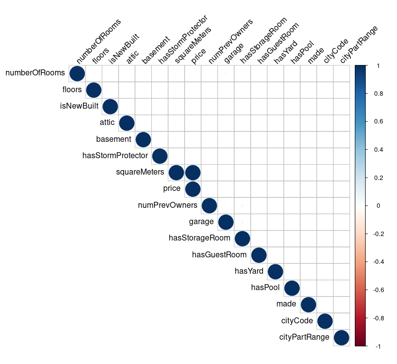
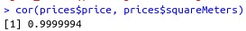
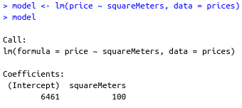
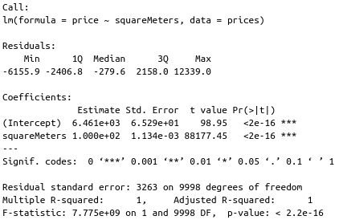
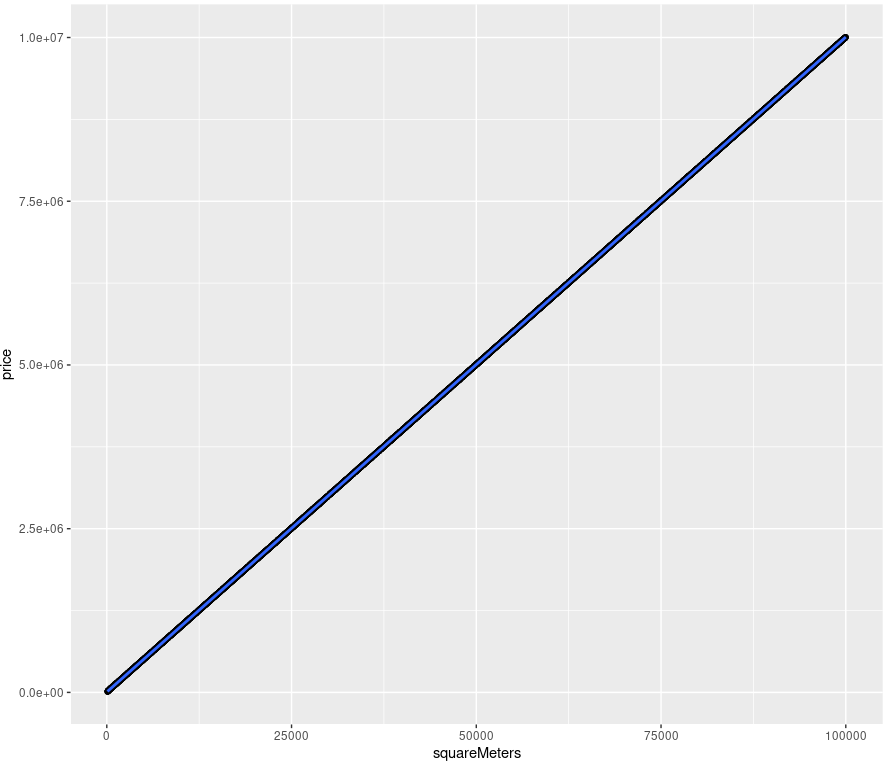
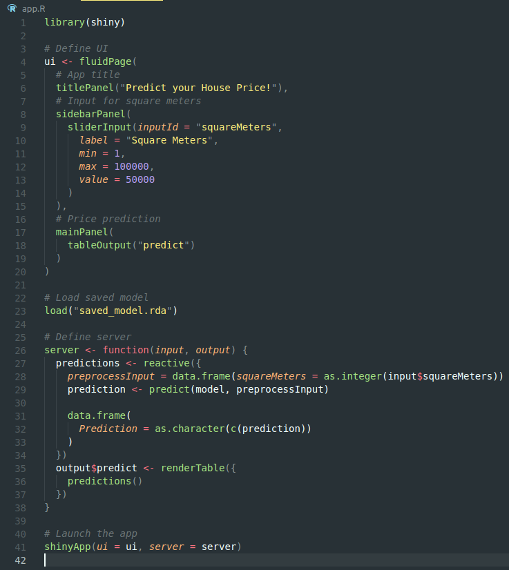
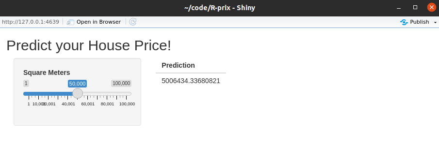

# Présentation Projet R + Shiny

## 1. Le dataset

Il s'agit d'un ensemble de données créées à partir de données imaginaires de prix des logements en milieu urbain - Paris.   
Je recommande d'utiliser cet ensemble de données à des fins éducatives, pour la pratique et pour acquérir les connaissances nécessaires.    

Tous les attributs sont des variables numériques et ils sont répertoriés ci-dessous :

- squareMeters
- numberOfRooms
- hasYard
- hasPool
- floors - number of floors
- cityCode - zip code
- cityPartRange - the higher the range, the more exclusive the neighbourhood is
- numPrevOwners - number of prevoious owners
- made - year
- isNewBuilt
- hasStormProtector
- basement - basement square meters
- attic - attic square meteres
- garage - garage size
- hasStorageRoom
- hasGuestRoom - number of guest rooms
- price - predicted value

## 2. Préparation des données

- Matrice de confusion:    

On voit qu'il n'existe aucune corrélation entre le prix (notre target) et les autres paramètres en dehors de la surface de l'habitat (`squareMeters`).  
Nous somme donc face à un problème de régression linéaire simple.

- Indice de corrélation:

## 3. Création du modèle

- Création du modèle de régression linéaire simple:

- Propriétés et métriques du modèle:

- Réprésentation graphique de la régression linéaire:

## 4. Interface Shiny

Le code peut être trouvé dans le fichier [app.R](app.R)

## 5. Essayer l'interface

- pré-requis:
    - R 
    - R Studio

1. Ouvrez le fichier `app.R` dans R Studio.
2. Effectuez la commande suivante dans la console R: `install.packages("shiny")`
3. Lancez l'application via le bouton `Run App` en haut à droite du fichier ouvert dans votre interface.

Voilà ce que vous devriez obtenir:

Il vous suffit de bouger le curseur pour voir apparaître une prédiction.